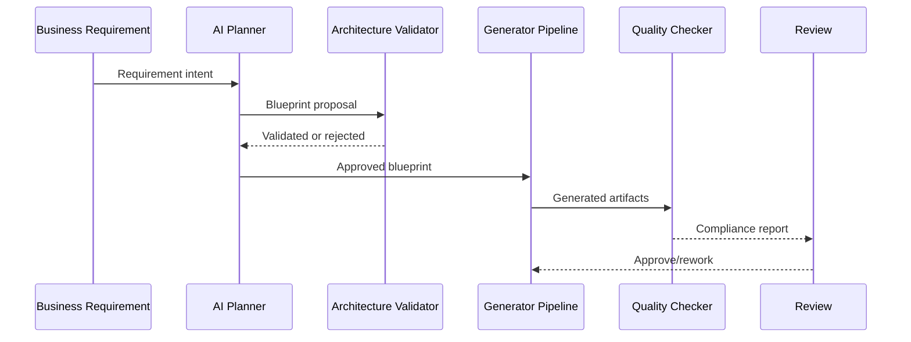

# ADT Sequence Diagrams

## End-to-End Engineering Pipeline

```mermaid
sequenceDiagram
    participant BR as Business Requirement
    participant AI as AI Planner
    participant AV as Architecture Validator
    participant GP as Generator Pipeline
    participant QC as Quality Checker
    participant RV as Review
    BR->>AI: Requirement intent
    AI->>AV: Blueprint proposal
    AV-->>AI: Validated or rejected
    AI->>GP: Approved blueprint
    GP->>QC: Generated artifacts
    QC-->>RV: Compliance report
    RV-->>GP: Approve/rework
```
